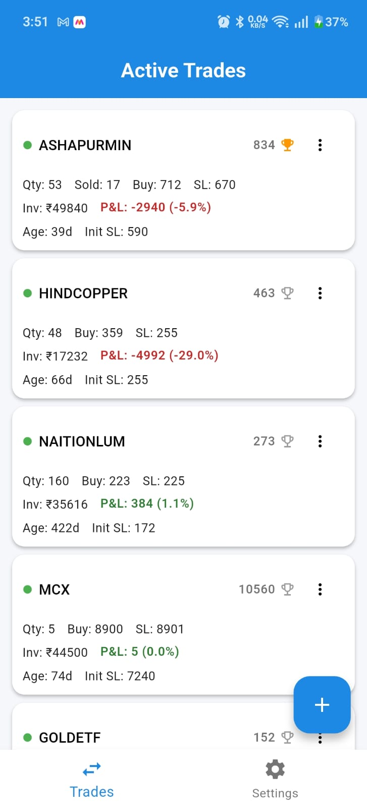
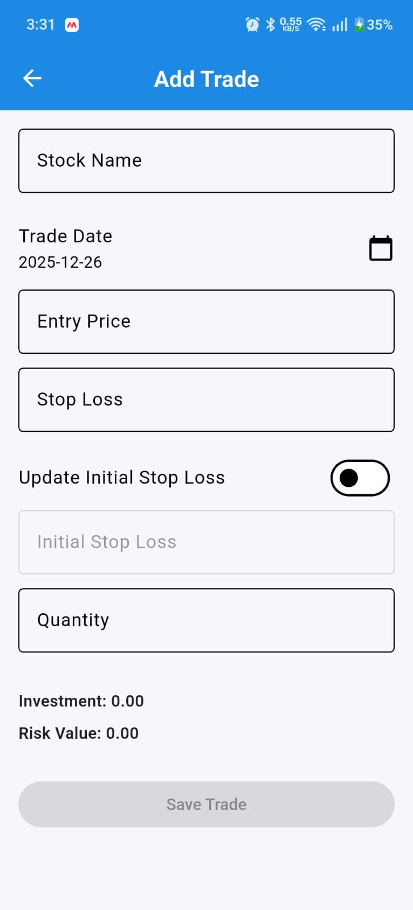
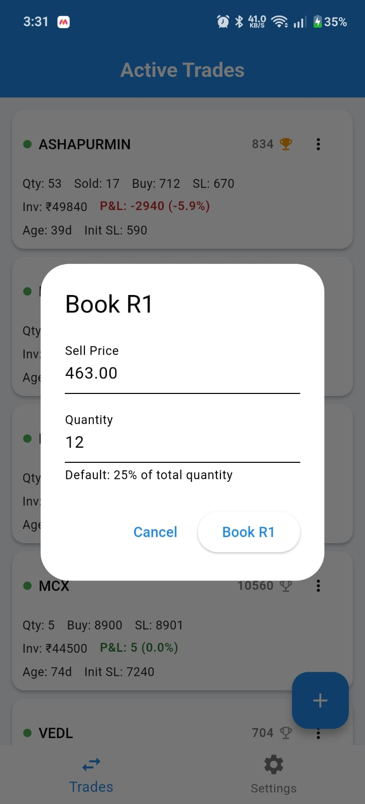
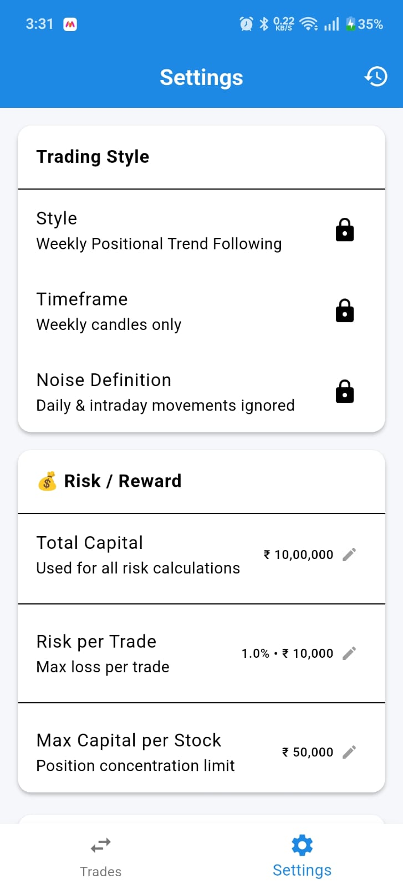

📘 Trading Engine – V1

Tagline:

No Rule, No Trade

Trading Engine is a rule-based positional trading app focused on capital protection, discipline, and consistency.
V1 is intentionally minimal and opinionated — built for real trading, not dashboards or vanity metrics.

🎯 Purpose of V1

V1 exists to answer one core question:

Can a trader strictly follow predefined rules with the help of software?

This version prioritizes:

Rule enforcement over analytics

Correctness over visual complexity

Discipline over flexibility

🧠 Trading Philosophy

Weekly positional trading

Rules are non-negotiable

Capital protection comes first

Decisions are made only at valid checkpoints

If rules are not met → No Trade

✅ Features Included in V1
1️⃣ Trade Management

Add, edit, and delete trades

Mandatory stop-loss

Quantity-based position sizing

Trade age tracking

Status handling (Active only in V1)

2️⃣ Risk & Capital Rules (Strictly Enforced)

Risk per trade (%)

Max capital per stock (%)

Portfolio risk cap ≤ 6%

Stop-loss cannot be bypassed

Trades violating rules are blocked at save time

3️⃣ R1 (Partial Profit) Handling

Mandatory R1 booking logic

Trophy icon for R1 state:

🏆 Outline → R1 not booked

🏆 Filled → R1 booked

Tap trophy:

Book R1 (if not booked)

View R1 details (if booked)

Undo R1 option available

Editing trade after R1 requires confirmation

4️⃣ Settings (Local, Rule-Driven)

Total Capital

Risk per Trade (%)

Max Capital per Stock (%)

Derived values auto-calculated

Settings stored locally (no login required)

5️⃣ Clean Trade UI

Focused trade cards

No clutter, no charts

All critical trade data visible at a glance

Consistent, distraction-free layout

---

## 📸 Screenshots (V1)

### Trades Screen
Shows active positional trades with risk, P&L, and R1 status.

---

### Add / Edit Trade
Rule-enforced trade creation with mandatory stop-loss and risk validation.

---

### R1 Partial Profit Booking
Mandatory partial profit logic with clear confirmation and undo support.

---

### Settings – Risk & Capital Rules
Centralized rule configuration used across the app.

❌ Intentionally Excluded from V1

The following are deliberately NOT included:

Login / Signup

Dashboard analytics

Equity curve

Market price fetching

Notifications

Reports / exports

Multi-user support

These are postponed to future versions based on real usage, not assumptions.

🧱 Architecture Highlights

Feature-based folder structure

Clear separation of:

UI

Validation

Data models

Firestore services

Rule validation lives outside UI

Safe async handling (mounted checks)

Designed to scale without refactoring core logic

🔐 Authentication & Data

No authentication in V1

Single-user, personal-use focus

Firestore used only for trade data

Settings stored locally

Authentication will be added only if/when required

🧪 Current Status

Version: V1

State: Feature-complete

UI: Locked for V1

Next step: Use in real trades

🧭 What Comes Next (V2 – Tentative)

Only after sufficient real usage:

Dashboard & portfolio overview

Trade history & performance analysis

Multi-device sync

Optional authentication

Advanced analytics

🧠 Final Note

A trading app doesn’t need to look exciting.
It needs to stop you from making mistakes.

Trading Engine V1 is built with that belief.

No Rule. No Trade.
✔ V1 Complete ✅